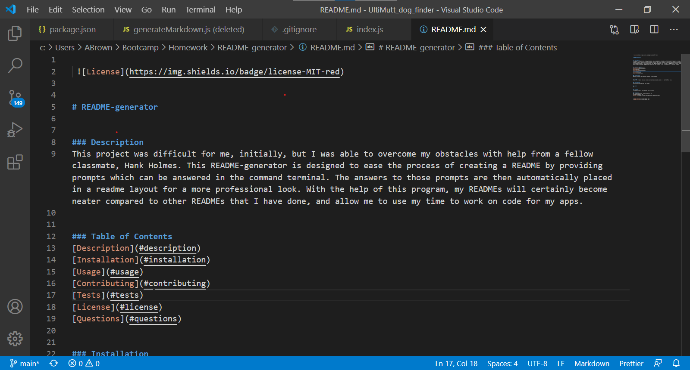
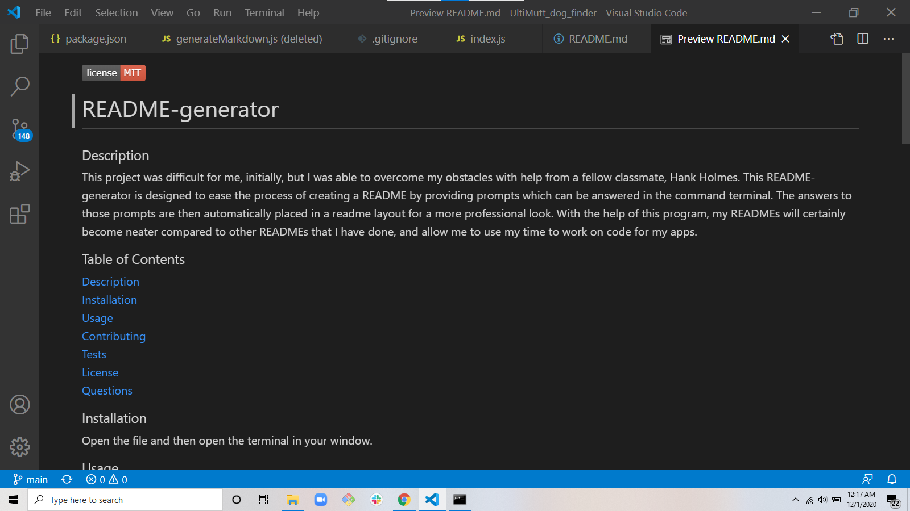

 

# README-generator  

### Description  
This project was difficult for me, initially, but I was able to overcome my obstacles with help from a fellow classmate, Hank Holmes. This README-generator is designed to ease the process of creating a README by providing prompts which can be answered in the command terminal. The answers to those prompts are then automatically placed in a readme layout for a more professional look. With the help of this program, my READMEs will certainly become neater compared to other READMEs that I have done, and allow me to use my time to work on code for my apps.

### Table of Contents  
[Description](#description)  
[Installation](#installation)  
[Usage](#usage)  
[Contributing](#contributing)  
[Tests](#tests)  
[License](#license)  
[Questions](#questions)  

### Installation  
Open the file and then open the terminal in your window.

### Usage  
Answer the prompts, and your answers will automatically be placed in a new README.md file.  

### Contributing  
Contributions provided by: Hank Holmes

### Tests  
N/A

### License  
This application is covered under the MIT license

### Questions  
For further questions, please contact me at:
averybgcoding@gmail.com  
[Github link](https://unchar.bootcampcontent.com/averyjbrown2/)  

### Demo Video  
[Sample Readme.md](https://drive.google.com/file/d/12ndz_vE1oEMYPIyKGhhqdEW0-TfFzlSb/view)    

### Images
  
